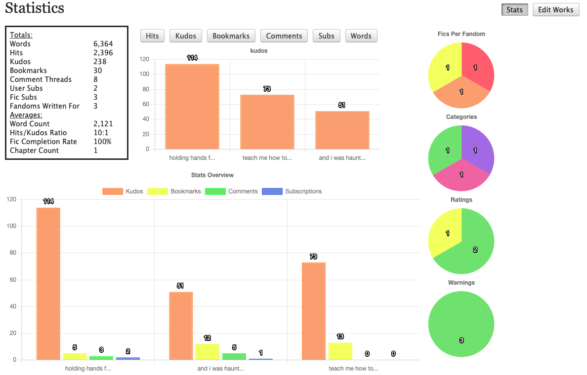

# Userscripts
Various userscripts I've made. Organised by website.

## Installation

1. Install a userscript addon such as [ViolentMonkey](https://violentmonkey.github.io/)
2. Click on either the raw file link and your addon should detect the file and prompt you to install, or the greasyfork link and install from there

## Summary

### Archive of Our Own

| Name                                 | Description                                                                                 | Raw File                                                                                                    | Greasy Fork                                                                                 |
|--------------------------------------|---------------------------------------------------------------------------------------------|-------------------------------------------------------------------------------------------------------------|---------------------------------------------------------------------------------------------|
| AO3: Stat Graphs+                    | New and improved statistics page for AO3                                                    | [GitHub](https://github.com/sharkcatshark/Userscripts/raw/main/AO3/stat-graphs.user.js)                     | [Greasy Fork](https://greasyfork.org/en/scripts/499201-ao3-stat-graphs)                     |
| AO3: Archived Bookmarks              | Tag a bookmark with 'Archived' or user chosen tag to have it automaticaly hidden from sight | [GitHub](https://github.com/sharkcatshark/Userscripts/raw/main/AO3/archived-bookmarks.user.js)              | [Greasy Fork](https://greasyfork.org/en/scripts/499196-ao3-archived-bookmarks)              |
| AO3: Display Full Work Conditionally | Multichaptered works under a certain word count will display entire work                    | [GitHub](https://github.com/sharkcatshark/Userscripts/raw/main/AO3/display-full-work-conditionally.user.js) | [Greasy Fork](https://greasyfork.org/en/scripts/499197-ao3-display-full-work-conditionally) |
| AO3: Fav Tag Counter                 | Add a little counter above favourited tags on homepage to view if you've reached the limit  | [GitHub](https://github.com/sharkcatshark/Userscripts/raw/main/AO3/fav-tag-counter.user.js)                 | [Greasy Fork](https://greasyfork.org/en/scripts/499198-ao3-fav-tag-counter)                 |
| AO3: Remove From List                | Adds a button to remove work from marked for later without deleting from history as well    | [GitHub](https://github.com/sharkcatshark/Userscripts/raw/main/AO3/remove-from-list.user.js)                | [Greasy Fork](https://greasyfork.org/en/scripts/499200-ao3-remove-from-list)                |
| AO3: Marked For Later In Sidebar     | Adds a link to marked for later in profile sidebar under history                            | [GitHub](https://github.com/sharkcatshark/Userscripts/raw/main/AO3/marked-for-later-in-sidebar.user.js)     | [Greasy Fork](https://greasyfork.org/en/scripts/499199-ao3-marked-for-later-in-the-sidebar) |

### Gossamer

| Name                         | Description                                            | Raw File                                                                                            | Greasy Fork |
|------------------------------|--------------------------------------------------------|-----------------------------------------------------------------------------------------------------|-------------|
| Gossamer Estimate Word Count | Adds a vague estimate of a word count to gossamer fics | [GitHub](https://github.com/sharkcatshark/Userscripts/raw/main/Gossamer/estimate-wordcount.user.js) |             |

### XKCD

| Name                | Description                                                     | Raw File                                                                                         | Greasy Fork |
|---------------------|-----------------------------------------------------------------|--------------------------------------------------------------------------------------------------|-------------|
| Explain XKCD Button | Adds a button to XKCD pages to redirect to the explanation wiki | [GitHub](https://github.com/sharkcatshark/Userscripts/raw/main/XKCD/explain-xkcd-button.user.js) |             |

### Witch Hat Atelier Wiki

| Name                    | Description                                                                       | Raw File                                                                                        | Greasy Fork |
|-------------------------|-----------------------------------------------------------------------------------|-------------------------------------------------------------------------------------------------|-------------|
| WHA Wiki Sidebar Addons | Adds personalised links to the WHA wiki sidebar for the Vector Legacy (2010) skin | [GitHub](https://github.com/sharkcatshark/Userscripts/raw/main/WHA-Wiki/sidebar-addons.user.js) |             |

## Details

### AO3: Stat Graphs+

This is one of my more detailed userscripts so I wanted to fully explain what it does and how it works. This is an almost complete overhaul of the statistics page on Archive of Our Own.

This is what my page looks like as an example:

Features:

- More compact summary box with additional statistics
  - Number of fandoms written for
  - Average word count
  - Average hits/kudos ratio
  - Fic completion rate
  - Average chapter count
- Instant toggling between metric graphs and ascending/descending
- An overview chart that shows all metrics for fics in one graph
- Pie Charts
  - Number of fics written per fandom
  - Number of fics written per category (ships)
  - Number of fics written per rating
  - Number of fics written per warning
- Quicker loading from not having to load new webpage

Customisable Settings:

- Number of fics shown per graph (Userscript's default is 10 as oppsoed to AO3's 5)
- Graph colours
- How many characters of a title should be shown before being cut off
- Fics with a value of 0 for any given metric can be hidden
- Set the default graph shown on page load (metric and order)
- Remove 'hits' from the overview graph as it can overwhelm it

Features Lost/Unsupported:

- Filtering stats by year
- Graph for oldest/newest fics (showing hits)
- Being able to bookmark pages for certain graphs
- Fandoms View summary box
